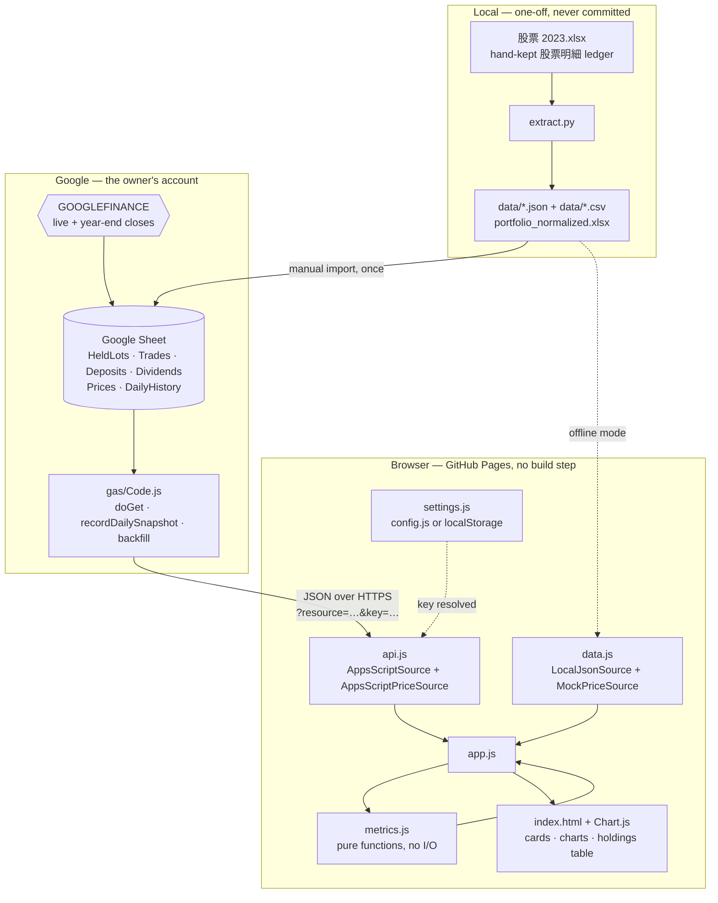
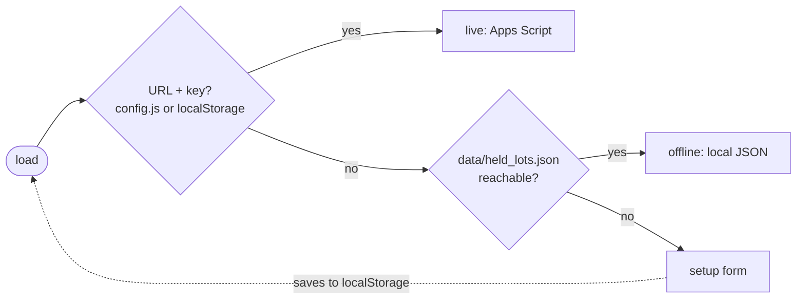

# Portfolio Dashboard

A static, single-page dashboard for a Taiwan-market (TWSE) stock portfolio. It reads a lot-based ledger held in a Google Sheet, prices it with `GOOGLEFINANCE`, and renders value, ROI, XIRR, dividends and per-year P/L in the browser.

No server: the frontend is plain ES modules on GitHub Pages, and the only backend is a Google Apps Script Web App bound to the owner's own Sheet.

Live: <https://llffhh.github.io/portfolio-dashboard/>

## What it shows

**Cards** — Current Value, Yesterday Close Value (with ▲/▼ delta), Invested Capital, Cost of Holdings (the ROI denominator), Total Dividends, ROI, XIRR, Simple CAGR.

**Charts** — Portfolio Value Over Time (Yearly / Daily toggle), Dividends per Year, Invested Capital per Year (with cumulative overlay), Yearly P/L excluding dividends.

**Table** — current holdings (ticker, shares, cost, live value, P/L %), sortable by any column.

Lots that can't be valued (blank share count, missing TWSE code, no price history) are never silently dropped — they surface in the yellow "Data needs review" notice at the top.

## Architecture



The app picks its source at startup:



### Ledger schema

| Tab | Shape |
|---|---|
| `HeldLots` | `{ date, ticker, shares, buyPrice, cost }` — lots still held; the source of truth for current position |
| `Trades` | `{ date, type: buy\|sell, ticker, shares, amount }` |
| `Deposits` | `{ date, amount }` — outside capital in (`CD轉入`); withdrawals (`CD轉出`) are negative |
| `Dividends` | `{ date, code, name, amount, detail }` |
| `Prices` | ticker → `{ 'YYYY-MM-DD': price }`, driven by `GOOGLEFINANCE` formulas |
| `DailyHistory` | one row per trading session, written by the Apps Script daily trigger |

Position is anchored to `HeldLots`, not replayed forward from `Trades` — the historical series walks *backwards* from today's known holdings, undoing each trade as it steps past its date. Today is exact by construction, and any gap in the trade ledger stays confined to dates before the trade it belongs to.

## Getting started

```bash
npm install
npm test
```

`npm test` runs the Vitest suite (25 tests: acceptance tests tied to `design.md` §A clauses, plus unit tests) against the synthetic fixtures in `fixtures/`. It needs no Google account and no real data.

To view the dashboard locally, serve the repo root over HTTP — ES modules won't load from `file://`:

```bash
npx serve .
```

With no `config.js` and no `data/`, the page shows the setup form. With `data/*.json` present it runs offline against your own extracted ledger. With `config.js` filled in it goes live.

### Connecting live data

Full walkthrough in [DEPLOY.md](DEPLOY.md). In short:

1. Import `portfolio_normalized.xlsx` into a new Google Sheet.
2. Paste `gas/Code.js` into **Extensions ▸ Apps Script**, set an `API_KEY` script property, deploy as a Web App (*Execute as* Me, *Who has access* Anyone).
3. Copy `config.example.js` to `config.js` and fill in the `/exec` URL and the key — or just paste both into the in-page setup form, which stores them in `localStorage`.
4. Optionally run `setupDailySnapshotTrigger()` once in the Apps Script editor to start recording daily closes, and `backfillDailySnapshots()` to fill the trailing 365-day window.

### Re-extracting the ledger

`extract.py` flattens the hand-kept `股票明細` sheet into the normalized schema. It needs `pandas` and `openpyxl`:

```bash
python extract.py
```

Outputs go to `data/` (JSON + CSV for Sheets import) and `portfolio_normalized.xlsx`. The classification rules — which ledger row becomes a dividend, a deposit, a trade, or a held lot — are documented in the module docstring and in `design.md` §A.1.

## Security and privacy

This repo is public and deploys to GitHub Pages, so the working assumption is that **anything committed is published**.

- The API key lives only in a gitignored `config.js` or in the browser's `localStorage`. `config.example.js` holds placeholders and is the only committed variant.
- `gas/Code.js` rejects any request without the matching key (`{"error":"unauthorized"}`), and caps price requests at 50 tickers of ≤20 chars.
- `.gitignore` excludes the real ledger — `data/`, `*.xlsx`, `*.csv`, root-level `transactions.json` / `dividends.json` — plus `.clasp.json` and `.clasprc.json` (OAuth tokens).
- `fixtures/` is synthetic and safe to commit; `data/` is real and is not.

The key gates data access, not much else: it's a shared secret in a browser, so treat it as "keeps the portfolio out of search results", not as authentication.

## Repository layout

| Path | |
|---|---|
| `index.html` | markup, styles, and the setup panel |
| `src/metrics.js` | pure metric functions — holdings, ROI, XIRR (Newton–Raphson), CAGR, per-year series |
| `src/api.js` / `src/data.js` | live and offline data/price sources behind one interface |
| `src/settings.js` | config resolution (`config.js` → `localStorage`) |
| `src/app.js` | wiring, chart construction, table sorting |
| `gas/Code.js` | Apps Script Web App: `doGet`, price lookup, daily snapshot + backfill |
| `extract.py` | ledger → normalized JSON/XLSX/CSV |
| `test/` | Vitest acceptance + unit tests |
| `fixtures/` | synthetic data for tests |

## Docs

- [design.md](design.md) — the approved plan: §A contracts (schemas, metric definitions, error taxonomy), §B blueprint (stack, components, trust boundaries).
- [task.md](task.md) — implementation checklist and build notes.
- [CHANGELOG.md](CHANGELOG.md) — revision history, including the reasoning behind each data-correctness fix.
- [DEPLOY.md](DEPLOY.md) — deployment runbook.
- [GEMINI.md](GEMINI.md) — role brief for the Gemini CLI coder in this project's SDLC pipeline.

## Known limitations

- A handful of tickers have no `GOOGLEFINANCE` price (delisted, or no known TWSE code), so years before full price coverage are dropped from the front of the value series rather than charted as misleading lows; partly-priced later years are charted and named in the review notice.
- A few 2020 trades carry a blank share count, which holds that position flat across those years in the historical chart.
- Daily history is a trailing 365-day window; a full 2017→ backfill would exceed the Apps Script 6-minute execution limit and read low in the early years.

## License

ISC.
